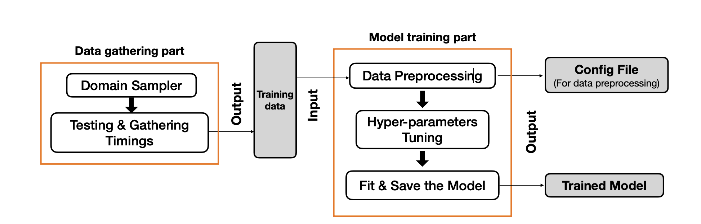
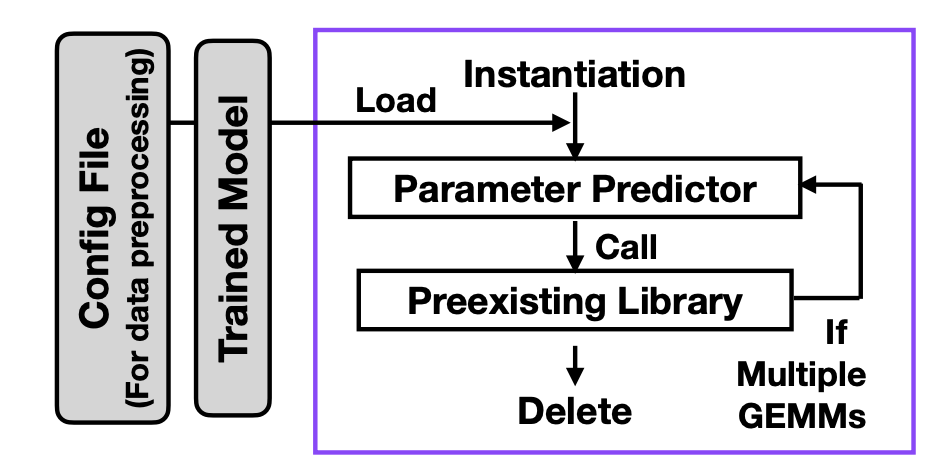

#### Conference Papers

##### Machine-Learning-Driven Runtime Optimization of BLAS Level 3 on Modern Multi-Core Systems (***Accepted***)

    

- **Authors**: Yufan Xia, Giuseppe Maria Junior Barca
- **Conference**: 2024 IEEE International Parallel and Distributed Processing Symposium (IPDPS)
- **Abstract**: BLAS Level 3 operations are essential for scientific computing, but finding the optimal number of threads for multi-threaded implementations on modern multi-core systems is challenging. We present an extension to the Architecture and Data-Structure Aware Linear Algebra (ADSALA) library that uses machine learning to optimize the runtime of all BLAS Level 3 operations. Our method predicts the best number of threads for each operation based on the matrix dimensions and the system architecture. We test our method on two HPC platforms with Intel and AMD processors, using MKL and BLIS as baseline BLAS implementations. We achieve speedups of 1.5 to 3.0 for all operations, compared to using the maximum number of threads. We also analyze the runtime patterns of different BLAS operations and explain the sources of speedup. Our work shows the effectiveness and generality of the ADSALA approach for optimizing BLAS routines on modern multi-core systems.
- **Link to Full Text**: TBA
- **Research Poster**: [View](/attaches/IPDPS24_poster.pdf) (Best Poster Awardee at IPDPS 2024)
- **Interactive Demo**: [View Demo](/ADSALA_demo.html)

##### A Machine Learning Approach Towards Runtime Optimisation of Matrix Multiplication

    

    

- **Authors**: Yufan Xia, Marco De La Pierre, Amanda S Barnard, Giuseppe Maria Junior Barca
- **Conference**: 2023 IEEE International Parallel and Distributed Processing Symposium (IPDPS)
- **Abstract**: The GEneral Matrix Multiplication (GEMM) is one of the essential algorithms in scientific computing. Single-thread GEMM implementations are well-optimised with techniques like blocking and autotuning. However, due to the complexity of modern multi-core shared memory systems, it is challenging to determine the number of threads that minimises the multi-thread GEMM runtime.We present a proof-of-concept approach to building an Architecture and Data-Structure Aware Linear Algebra (ADSALA) software library that uses machine learning to optimise the runtime performance of BLAS routines. More specifically, our method uses a machine learning model on-the-fly to automatically select the optimal number of threads for a given GEMM task based on the collected training data. Test results on two different HPC node architectures, one based on a two-socket Intel Cascade Lake and the other on a two-socket AMD …
- **Link to Full Text**: [A Machine Learning Approach Towards Runtime Optimisation of Matrix Multiplication](https://ieeexplore.ieee.org/abstract/document/10177426)

#### Journal Papers

> TBA

<!-- ### Article Title 1
- Authors: Author Name 1, Author Name 2
- Published in: Journal Name
- Year: 2024
- Abstract: This is the abstract of the article.
- Link to Full Text

### Article Title 2
- Authors: Author Name 1, Author Name 2
- Published in: Journal Name
- Year: 2023
- Abstract: This is the abstract of the article.
- Link to Full Text -->
